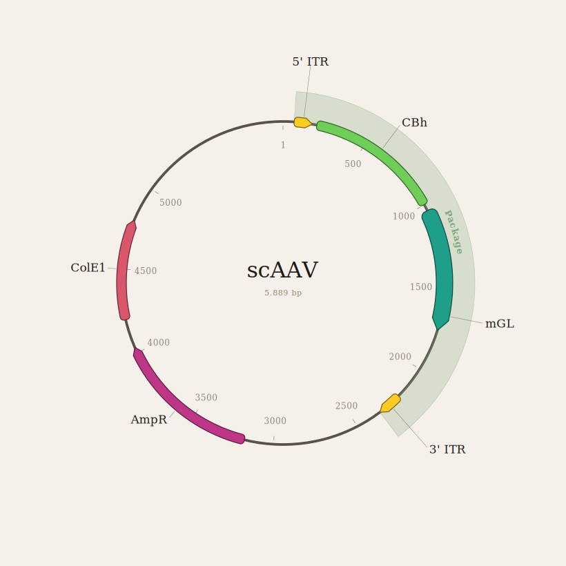
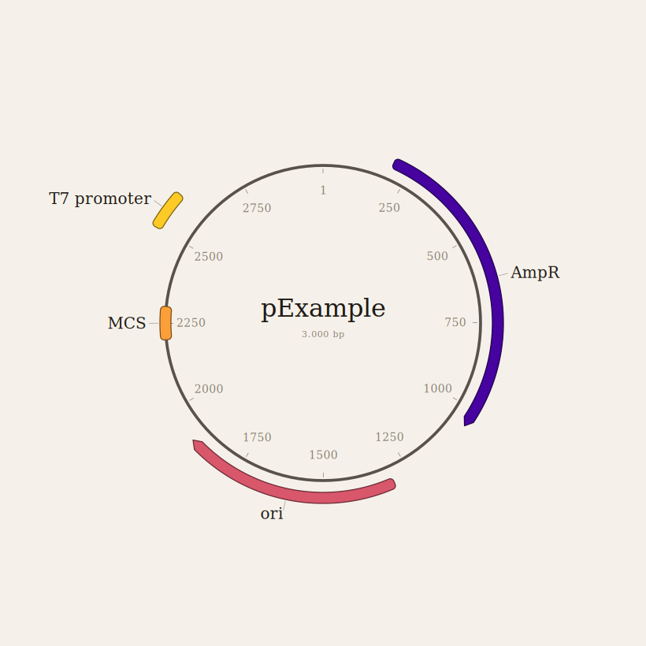
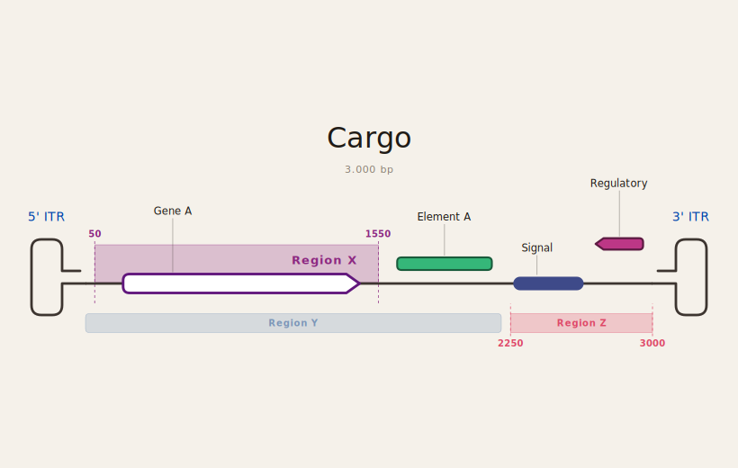

# Plasmid Studio

Plasmid Studio is a browser-based sequence map editor for making clean,
exportable plasmid and linear sequence diagrams.

The app lets you paste or edit a DNA sequence, add annotated features by
base-pair position or sequence search, switch between circular and linear
representations, style the map, and export the active view as an SVG.

## Features

- Two rendering modes: a **circular plasmid map** tab and a **linear sequence tab** with rich formatting options, including DNA strand thickness and colors.
- Linear sequence rendering with selectable termini, including open ITR-style terminal loops, or broken-sequence
  `...//` markers.

- Feature annotations with arrows, blocks, or line segments.
- Annotation lookup by explicit start/end position or by sequence match,
  including reverse-complement matching. Circular mode supports wraparound
  matches; linear mode validates features as non-wrapping ranges.
- Multi-ring layouts with per-feature formatting controls.
- Translucent labeled highlight regions with optional boundary
  markers.
- Toggleable tick marks and tick labels.
- SVG export for publication figures, slides, and design notes.

> [!tip]
Launch plasmid.studio:
<a href="https://prion-1.github.io/Plasmid-Studio/">
  -LAUNCH-2ea44f?style=for-the-badge" alt="Launch">
</a>

## Examples

<p align="center">
  
  
</p>
<p align="center">
  
</p>

## Development

Install dependencies:

```bash
npm install
```

Run the local development server:

```bash
npm run dev
```

Build the production site:

```bash
npm run build
```

Preview the production build locally:

```bash
npm run preview
```

## Deployment

This repo is configured for GitHub Pages at:

```text
https://prion-1.github.io/Plasmid-Studio/
```

The Vite base path is set in `vite.config.js`, and `.github/workflows/deploy.yml`
builds `dist/` and publishes it with GitHub Pages Actions.

## License

Plasmid Studio is licensed under the GNU General Public License v3.0. See
`LICENSE` for the full license text.
